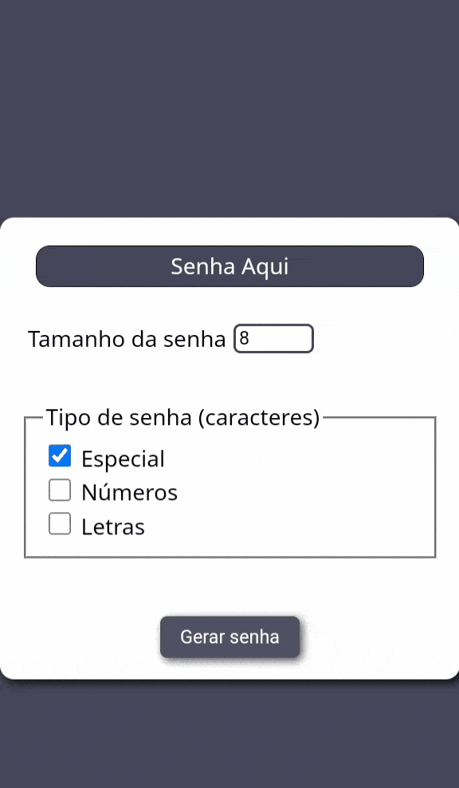
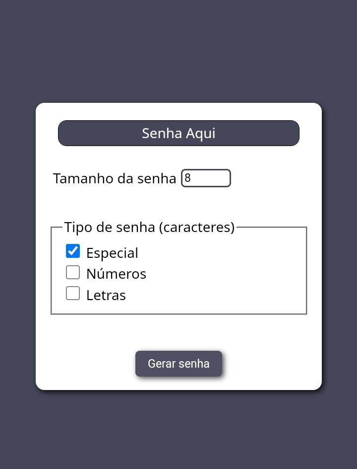

<h1 align="center">Gerador de senhas</h1>
  
Um gerador simples de senhas, que gera senhas com números, letras ou/e caracteres especiais. (Não é recomendado o uso das senhas em contas de banco, contas de redes socias ou outro tipo de conta sensível)

<h4>:link:
<a href="https://geradordesenhas-six.vercel.app">Acesse aqui</a>
</h4>

<h4>🖱️Tecnologias</h4>
<ul>
   <li>HTML</li>
   <li>CSS</li>
   <li>JavaScript</li>
</ul>

<h4>:mailbox: Autor</h4>

Feito por Pedro Freitas

